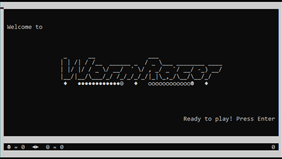

# WormRacer
A simple terminal node.js based multiplayer game.

This game is a different version of a classic game, where players control "worms" to collect food. Also Players try to lure each other into their tail, creating strategic gameplay mechanics.

## Table of Contents
1. [Gameplay](#gameplay)
2. [Installation](#installation)
3. [Starting the Game](#starting)
4. [How to Play](#how-to-play)
5. [Conditions](#conditions)
6. [Tech Stack](#tech-stack)
8. [Warning](#warning)
9. [License](#license)

##  Gameplay
You can move, but you don't have to. You can change directions instantly as long as you do not have 2 or more tail parts, after that you would collide into your own tail.
Btw, collect as much food with your worm as you can. Only the tails do collide with other worms.

##  Installation

> [!NOTE]
> Make sure you have Node.js installed: https://nodejs.org/
> Clone the repository to your local machine or download packed file and extract it somewhere.

To install the game, you have two options: 

### 1. Terminal
1. Open terminal and navigate to the project directory.
2. Install dependencies with `npm install`.

### 2. Use the batch file
You can just execute `Install.bat` and follow the on screen instructions. 

##  Starting the Game
To start a new game, you have two options:

### 1. Terminal
**Host a Game**:
 Start a server locally with default port ready for clients to join:
 `node server.js`

You can Provide a Port as you wish:
 `node server.js 12345`

**Join a Game**: 
 Start a client and joins with default IP and port: 
 `node client.js` 
 
Connect to specific IP and port:
 `node client.js 0.0.0.0:12345`

**Join a Game as CPU/Bot**: 
 Start a cpu client and joins with default IP and port: 
 `node cpuClient.js`  

Connect to specific IP and port:
 `node cpuClient.js 0.0.0.0:12345` 

### 2. Use the batch file
You can just execute `Start.bat` and follow the on screen instructions. 

##  How To Play
Use `arrow keys` to move your worm. Collect food and try to lure other clients into collisions by leading them towards your tail.

##  Conditions
The server will wait for exactly two players to connect.
The game ends when any player's worm "collides" with another player's worms tail, a wall or their own tail. After a collision, you will be prompted to start a new game.

##  Tech Stack
- **Node.js**: Runtime environment for server-side code execution and for handling the client as well.
- **Socket.io**: Real-time communication library for multiplayer support.

##  Warning
> [!WARNING]
> This project uses Socket.io for host-client interaction and is NOT coded with safety in mind at all!
It is a low level code with basic functionality... for multiplayer support.
Please use at your own risk, I am not responsible for skynet infiltrating your home and start revolution. You be warned! 

##  License
This project is licensed under the `MIT License`.